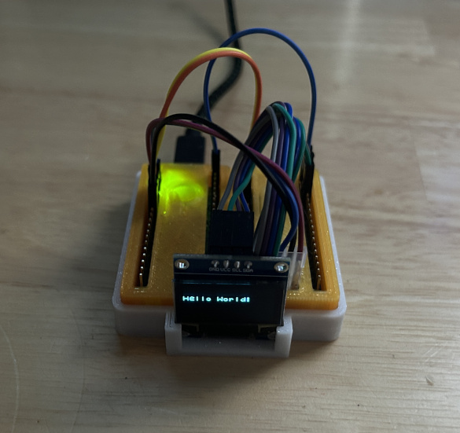

# pico-SSD1306_text

A library for using LCDs powered by the SSD1306 controller as a text
display with Raspberry Pi Pico 

## Introduction

This library is designed to make use of an LCD driven by an
[SSD1306](https://cdn-shop.adafruit.com/datasheets/SSD1306.pdf) controller.

The library provides simple routines to initialize the LCD, clear the display,
position the cursor, and write strings to the display at the cursor position.
There is no graphics mode support.  The font is a simple fixed font with each
character mapped in an 8x8 area.  The display is subdivided into 8x8 sections
and treated as a character display device.

## Usage

### Create An Instance Of The SSD1306_text Class

All interaction with the LCD is done through an instance of the SSD1306_text
class.  The constructor has six optional arguments.

    SSD1306_text(uint height=64, uint width=128,
                 uint i2c_addr=0x3c, i2c_inst_t *i2c=i2c_default,
                 uint sda=PICO_DEFAULT_I2C_SDA_PIN,
                 uint scl=PICO_DEFAULT_I2C_SCL_PIN);
    height - Height of the display in pixels
    width - Width of the display in pixels
    i2c_addr - Address of the display on the I2C bus
    i2c - One of the I2C blocks in the pico (i2c0 or i2c1)
    sda - GPIO to be used for SDA of the I2C bus
          (must be valid for the i2c chosen)
    scl - GPIO to be used for SCL on the I2C bus
          (must be valid for the i2c chosen)

### Use The Display

The remaining methods of the SSD1306_text class are for manipulating the LCD.

#### void SSD1306_text::clear(void)

Clear the screen and move the cursor to the home position

#### void SSD1306_text::clear_line(void)

Clear the current line and move the cursor to the beginning of the line

#### void SSD1306_text::position(uint row, uint col)

Move the cursor to the specified position

#### void SSD1306_text::write_string(const char *str)

Display the specified string at the current cursor position

## Adding The Library To Your Project

Adding the library to a project is done with two CMake commands.  First the
directory containing the library must be added to the project using
[add_subdirectory()](https://cmake.org/cmake/help/latest/command/add_subdirectory.html)
If the path is relative, then a name for the directory used for compiling
sources must be provided (SSD1306_text is probably a good choice).  Following
this the library must be added as a link target using
[target_link_libraries()](https://cmake.org/cmake/help/latest/command/target_link_libraries.html).
E.g.

    add_subdirectory(../.. SSD1306_text)
    target_link_libraries(hello_lcd pico_stdlib SSD1306_text)

## Examples

The examples subdirectly shows working case.
